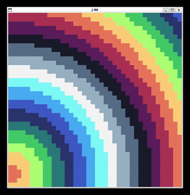

# Description

Raylib bindings for the J programming language

# Example

```j
load 'j-raylib.ijs'
coinsert 'rl'

i =. 100
p =. 10 +  (? i # ,: 480 480)
s =.  5 -~ (? i # ,:  10  10)
c =. ColorFromHSV"1 (1,.~ 1,.~ ? i $ 360)
bs =: p,.10,.c,.s

bg =: Color 20 20 20 255

Move =: {{
    (+/ (0 1,:4 5) { y) (0 1)} y
}}

Bounce =: {{
    e =. <: +: (((490 > ]) *. (10 < ])) 0 1 { ]) y
    (e * 4 5 {"1 y) 4 5} y
}}

InitWindow 500;500;'bounce'
SetTargetFPS 60

Step =: {{
    BeginDrawing ''
    ClearBackground bg
    bs =: Move@Bounce"1 bs
    DrawCircle"1 (i. 4) <@{"1 bs
    EndDrawing ''
    bs
}}

(Step)^:(-.@WindowShouldClose&'')^:(_) ''
CloseWindow ''
```


# Dependencies

You will need to have the [raylib](https://github.com/raysan5/raylib) shared lib already installed.

For Linux, I just compiled with `cmake` and the `-DBUILD_SHARED_LIBS=ON` flag.
See the raylib readme and docs for more info

For Windows, I downloaded the MSVC zip from the GitHub [releases](https://github.com/raysan5/raylib/releases/tag/5.0) page and extracted it to my `%USERPROFILE` (`C:\Users\NAME\raylib`)
 
The location is currently hard-coded at to top of `j-raylib.ijs`, so you may need to update that.

# Installation

For now, just download `j-raylib.ijs` and load it via it's path, ie. `load 'j-raylib.ijs`.
I did want to make a J addon that can be installed directly in J, but it seems J doesn't like GitHub usernames beginning with a digit. I will look into alternate options.

# Usage and limitations

There's no 3d support yet, nor the use of any other structs apart from `Vector2` and `Color`.
To create `Vector2` and `Color` value structs, I'm doing a bit of bit gymnastics that the FFI (on my machine) seems happy with. I'm not sure if it will work on 32-bit platforms correctly.

All functions (including the `Vector2` and `Color` J helper verbs) are under the `rl` Locale.
All colors are under Locale `rlcolor`, and enums are under Locale `rlenum`.
If you want to load in everything into your current Locale, just `coinsert 'rl rlcolor rlenum'`.

I was thinking of further breaking the enums out into their own locales, because, eg. The 3D related ones are currently useless in J.

# More examples

Here's another example with more interactivity.

```j
load 'j-raylib.ijs'
coinsert 'rl rlcolor rlenum'

arrows =: KEY_RIGHT,KEY_DOWN,KEY_LEFT,KEY_UP
dirs   =: (, -) =/~ i. 2
speed  =: 5

'width height' =: 800,450
cpos =: Vector2 <. 2 %~ width,height

Init =: {{
    InitWindow width;height;'test'
    SetTargetFPS 60
    ShowCursor ''
    SetMouseCursor MOUSE_CURSOR_CROSSHAIR
}}

Update =: {{
    dir =. speed * +/ dirs #~ IsKeyDown"0 arrows
    cpos =: (dir + ])&.Vector2_J cpos
}}

Draw =: {{
    ClearBackground DARKGRAY
    DrawText 'move the ball with the arrow keys';10;10;20;WHITE
    DrawCircleV cpos;50.0;GOLD
    if. IsCursorOnScreen '' do.
        mXY =. ',' joinstring ":&.> Vector2_J mpos =. GetMousePosition ''
        DrawText mXY;(width-100);(height-20);20;WHITE
        if. IsMouseButtonDown MOUSE_BUTTON_LEFT do.
            DrawCircleV mpos;10.0;BLUE
        end.
    end.
}}

MainLoop =: {{
    Update ''
    BeginDrawing ''
    Draw ''
    EndDrawing ''
    GetTime ''
}}

Init ''
(MainLoop)^:(-.@WindowShouldClose&'')^:(_) ''
CloseWindow ''
```


---

A toy inspired by [BQN-80](https://dancek.github.io/bqn-80/) (available in the 'examples' folder)

```j
load 'j-raylib.ijs'
coinsert 'rl rlcolor rlenum'

'WIDTH HEIGHT' =: 800 600

COLORS =: Color@".;._2 {{)n
 26  28  44 255
 93  39  93 255
177  62  83 255
239 125  87 255
255 205 117 255
167 240 112 255
 56 183 100 255
 37 113 121 255
 41  54 111 255
 59  93 201 255
 65 166 246 255
115 239 247 255
244 244 244 255
148 176 194 255
 86 108 134 255
 51  60  87 255
}}

Init =: {{
    SetTraceLogLevel LOG_ERROR
    InitWindow WIDTH;HEIGHT;'raymat'
    SetTargetFPS 15
}}

DrawMat =: {{
    q =. |. >. (HEIGHT,WIDTH) % $ y 
    a =. <"0 q,"1~ q *"1 |."1 (#: i.@(*/)) $ y
    DrawRectangle a ,. <"0 x {~ (<: # x) AND , y
}}

Run =: {{
    Init ''
    fc =. 0
    while. -. WindowShouldClose '' do.
        fc =. >: fc
        BeginDrawing ''
        x DrawMat y =. fc u y
        EndDrawing ''
    end.
    CloseWindow ''
}}

a =. |. <. {.@*. (_1 + 0.4 * ])@j./~ i. 40
Step =: (# COLORS) | <:@]
COLORS Step Run a
```


